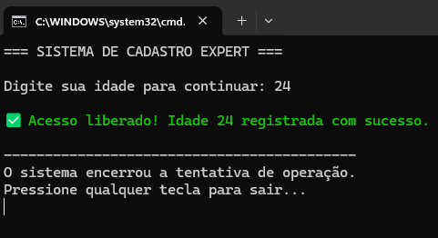
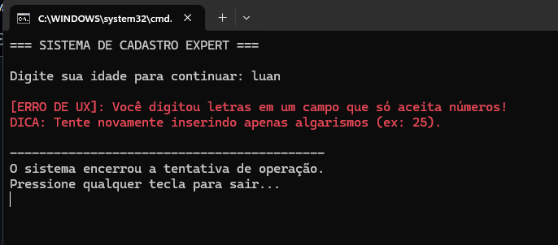

# SistemaRobusto

## Descrição
Este projeto foi desenvolvido em .NET com o objetivo de demonstrar a importância de um sistema robusto, capaz de lidar tanto com entradas válidas quanto inválidas.

A aplicação valida os dados inseridos pelo usuário e fornece respostas adequadas para cada situação, garantindo uma boa experiência.

## Objetivo
Demonstrar o tratamento de erros e a validação de entrada de dados, apresentando mensagens claras tanto para sucesso quanto para falha.

## Conceito Aplicado
Registro de Evidência (A "Prova do Crime")

O sistema deve ser capaz de lidar com diferentes tipos de entrada, garantindo funcionamento correto e mensagens amigáveis ao usuário.

## Estrutura do Projeto
- Program.cs: Contém a lógica de validação de entrada e tratamento de erros.

## Exemplo de Execução

### Print 01 - Caminho Feliz
Usuário insere um valor válido e o sistema retorna sucesso:

### Print 02 - Caminho de Erro
Usuário insere um valor inválido (ex: texto) e o sistema retorna uma mensagem de erro amigável:

## Conclusão
A aplicação demonstra a importância de validar entradas e tratar erros corretamente. Um sistema robusto evita falhas inesperadas e melhora a experiência do usuário ao fornecer feedback claro em qualquer situação.
